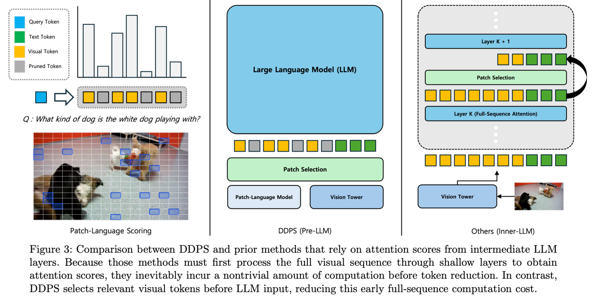

# DDPS

## 왜 DDPS가 필요한가



### 1. Inner-LLM selection 방식의 한계

기존 `inner-LLM` 계열은 LLM 내부 attention score나 중간 layer의 importance signal을 이용해 필수적인 시각 패치를 고르거나 pruning합니다. 하지만 이 접근은 다음 문제를 가집니다.

- patch selection이 LLM 내부 구조와 attention 구현에 강하게 묶여 있어 **plug-and-play 적용이 어렵습니다**.
- attention map을 먼저 얻기 위해서는 이미 상당한 수의 visual token을 LLM 안으로 넣어 early layer 계산을 수행해야 하므로, **초기 prefill 비용을 미리 지불한 뒤에야 줄일 수 있습니다**.
- attention score는 layer, prompt wording, decoding context, head 구성에 따라 크게 흔들릴 수 있어, **안정적인 patch importance 신호로 쓰기 어렵습니다**.
- 모델별 tokenizer, image placeholder layout, forward path 차이가 커서, 같은 아이디어라도 모델이 바뀌면 구현을 다시 맞춰야 하는 경우가 많습니다.

즉, inner-LLM 방식은 "어떤 토큰이 중요한지"를 모델 내부에서 찾으려는 대신, 그 대가로 구조 의존성과 적용 복잡도를 함께 떠안습니다.

### 2. Non-train-free token compression / pruning 방식의 한계

또 다른 계열은 학습 가능한 projector, token compressor, pruning module을 추가하거나 재학습을 통해 토큰 수를 줄입니다. 이 접근 역시 실용성 측면에서 비용이 큽니다.

- 추가 학습이 필요해 **train-free가 아니며**, 데이터와 학습 자원이 충분히 있어야 합니다.
- 특정 backbone이나 training recipe에 맞춰 튜닝되기 쉬워 **새 모델로 옮길 때 재학습 비용**이 발생합니다.
- 압축 과정에서 query-irrelevant token만 줄이는 것이 아니라, 실제로 필요한 fine-grained visual evidence까지 함께 손실될 수 있습니다.
- 학습된 압축기는 성능과 효율의 절충을 잘 만들 수는 있지만, 실험 재현과 배포 측면에서는 진입 비용이 높습니다.

즉, non-train-free 방식은 성능 최적화 여지는 있지만, 가볍게 붙여서 바로 비교하거나 새 환경에 즉시 적용하기에는 부담이 큽니다.

### 3. DDPS의 필요성

DDPS는 위 두 부류의 문제를 피하기 위해 **pre-LLM patch selection**을 택합니다. 핵심 아이디어는 LLM 내부 attention이 형성된 뒤 뒤늦게 토큰을 줄이는 것이 아니라, **LLM에 들어가기 전에 query-relevant patch만 먼저 선택**하는 것입니다.

이 접근이 필요한 이유는 명확합니다.

- 불필요한 visual token을 LLM 앞단에서 제거하므로 **초기 prefill 연산 자체를 바로 줄일 수 있습니다**.
- LLM 내부 attention 구현을 뜯어고치지 않으므로 **plug-and-play 적용성이 높습니다**.
- 별도 재학습 없이 동작하므로 **train-free 방식으로 다양한 실험 설정에 바로 붙일 수 있습니다**.
- 질의와 직접 관련된 패치를 우선 보존하므로, 무작위 압축보다 **설명 가능한 선택 기준**을 제공합니다.

## DDPS의 특징

현재 저장소의 DDPS 구현은 다음 성격을 가집니다.

- **Pre-LLM selection**: visual token을 LLM 입력 전에 줄입니다.
- **Train-free**: 추가 학습 없이 바로 적용합니다.
- **Query-aware**: 사용자 질의를 기준으로 patch relevance를 계산합니다.
- **Plug-and-play**: LLaVA 기반 추론 파이프라인에 selector 형태로 연결됩니다.
- **효율 측정 가능**: visual token 수, prefill token 수, 추정 TFLOPs를 함께 기록해 정확도-효율 trade-off를 비교할 수 있습니다.

정리하면 DDPS는 "모델 내부를 크게 건드리지 않으면서", "재학습 없이", "LLM이 보기 전에" 필요한 시각 패치를 고르는 실용적인 선택 전략입니다.


## 환경 설정

기본 실행 의존성:

```bash
pip install -r requirements.txt
```

추가 의존성:

- VQAv2 다운로드/평가: `pip install datasets`
- Google Drive 동기화 유틸: `pip install -r requirements.launch.txt`

GPU 사용 전에는 각 설정 파일의 `vlm.model_kwargs.device_map` 값을 현재 환경에 맞게 수정하는 편이 안전합니다. 현재 설정 파일들은 `cuda:0`, `cuda:1`, `cuda:2`를 혼용하고 있습니다.

기본 모델 저장 위치는 `./model/repo`입니다. 첫 실행 시 Hugging Face에서 모델을 내려받습니다.

## 빠른 시작

### 1. 단일 이미지 추론

기본 추론:

```bash
python model/invoke.py \
  --config-name base \
  invoke.image_path=./data/image.png \
  invoke.query_file=./model/query.txt
```

DDPS 추론:

```bash
python model/invoke.py \
  --config-name DDPS \
  invoke.image_path=./data/image.png \
  invoke.query_file=./model/query.txt
```

랜덤 패치 선택 baseline:

```bash
python model/invoke.py \
  --config-name random \
  invoke.image_path=./data/image.png \
  invoke.query_file=./model/query.txt
```

`FastV`, `SparseVLM`도 같은 방식으로 `--config-name fastv`, `--config-name sparsevlm`를 사용하면 됩니다.


### 2. VQAv2 평가

VQAv2 `val` split 다운로드:

```bash
python data/download/vqa_v2.py val ./data/VQAv2/val
```

DDPS 평가 예시:

```bash
python eval/vqa_v2.py \
  experiment=DDPS \
  vqav2.dataset_root=./data/VQAv2 \
  vqav2.split=val \
  vqav2.require_answers=true
```

랜덤 baseline 평가 예시:

```bash
python eval/vqa_v2.py \
  experiment=random \
  vqav2.dataset_root=./data/VQAv2 \
  vqav2.split=val \
  vqav2.require_answers=true
```

평가 결과는 기본적으로 `./eval/result/VQAv2` 아래 JSONL로 저장됩니다.

### 3. GQA 평가

GQA 데이터는 자동 다운로드 스크립트가 없으므로 직접 `./data/GQA` 아래에 준비해야 합니다. 평가 스크립트는 split 이름에 따라 질문 파일을 자동 탐색합니다.

예시:

```bash
python eval/gqa.py \
  experiment=DDPS \
  gqa.dataset_root=./data/GQA \
  gqa.split=val \
  gqa.require_answers=true
```

결과는 기본적으로 `./eval/result/GQA` 아래에 저장됩니다.

## 설정 방식

### 추론 설정

`model/invoke.py`는 Hydra의 `config/` 아래 설정 파일 하나를 직접 사용합니다.

- `--config-name base`
- `--config-name DDPS`
- `--config-name random`
- `--config-name fastv`
- `--config-name sparsevlm`

### 평가 설정

평가 스크립트는 항상 `config/eval.yaml`을 시작점으로 쓰고, 그 안의 `experiment` 값으로 실험 설정 파일을 불러옵니다.

예를 들어 아래 두 명령은 같은 의미입니다.

```bash
python eval/vqa_v2.py experiment=DDPS
python eval/gqa.py experiment=DDPS
```

즉, 평가에서는 `experiment=<config 이름>`을 바꿔가며 비교하는 구조입니다.

